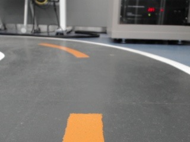
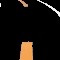
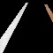
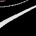
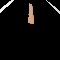
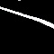
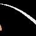
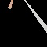
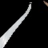

# 自動運転カー

※ このプロジェクトは大学のキャップストーン・デザイン授業において「自動運転カー」というテーマのもと実施され、部品の選定・設計・実装などすべての工程を学生主導で自主的に進めました。

<p> 
  <a href="README.md">日本語</a> 
  ·
  <a href="/README_ko.md">한국어</a> 
</p>

# 目次

[1. プロジェクト概要](#プロジェクト概要)

[2. デモ動画](#-デモ動画)

[3. 主な構成部品と技術スタック](#主な構成部品と技術スタック)

[4. データセット構成](#データセット構成)

# プロジェクト概要

本プロジェクトは、カメラ映像をもとに道路状況を認識し、CNN モデルを用いてリアルタイムにステアリング角度と速度を予測しながら車両を制御する軽量自動運転システムです。

低電力の組み込みボード上でも円滑に動作するように軽量化を重視し、ハードウェア制御と AI 推論を統合した構成で設計されています。

# 🎬 デモ動画

| 自動運転およびシステム画面（Shorts）                                                                   | 全体走行映像（タイムラプス）                                                                  |
| ------------------------------------------------------------------------------------------------------ | --------------------------------------------------------------------------------------------- |
| [](https://youtube.com/shorts/T73CptfG0oE) | [](https://youtu.be/Ltm1orm_lTM) |

<br>

# 主な構成部品と技術スタック

### 🔧 ハードウェア

| 構成要素                   | 用途                             |
| -------------------------- | -------------------------------- |
| Jetson Nano (4GB)          | カメラ入力、モデル推論、車両制御 |
| サーボモーター (MG996R)    | ステアリング制御（左右回転）     |
| DC ギアドモーター          | 車両の推進                       |
| モータードライバ (L298N)   | モーター駆動制御                 |
| カメラ (Logitech C920 PRO) | 前方道路の画像入力               |
| RC シャーシ                | 全体構成パーツを搭載する車両基台 |

---

### 💻 ソフトウェア / ライブラリ

| 項目        | 説明                              |
| ----------- | --------------------------------- |
| Python 3.6  | メインプログラム実装言語          |
| PyTorch 1.9 | CNN モデルの構築・学習・推論      |
| OpenCV 4.1  | 画像処理および可視化処理          |
| NumPy       | データ前処理および CSV ラベル処理 |

# データセット構成

本プロジェクトでは、室内トラックという固定された環境で収集されたデータに基づき、
軽量化と安定した走行性能の確保を目的として学習を行いました。

### データ構造

- 総画像数：約 14,500 枚
- 入力サイズ：320×240（RGB）
- ラベル構成：全 6 種の組み合わせ
  - 通常速度：左折（2 段階）、直進、右折（2 段階）
  - 最高速度：直進のみ
- 保存方式:
  - ディレクトリ名がステアリング角と速度のラベルを表し、そのフォルダ内に画像が保存されます。

```bash
images/
    ├── angle_70/
    │   ├── 0001.jpg
    │   ├── 0002.jpg
    ├── angle_85/
    │   ├── 0001.jpg
    └── angle_100/
        ├── 0001.jpg
        ...
```

### 🧼 前処理

- ROI 抽出：320×240 → 320×160（下部 2/3 のみ使用）
- 画像リサイズ：320×160 → 60×60
- トラックライン抽出：**白と黄色**のみをマスキングして背景を除去
- 重複フレームや異常値の除去

| 元画像                                     | ROI & リサイズ                                                         | マスキング結果                                                        |
| ------------------------------------------ | ---------------------------------------------------------------------- | --------------------------------------------------------------------- |
|  | <div align="center"></div> | <div align="center"></div> |

### 🖼️ ステアリング角ごとの学習画像サンプル

以下は、各ステアリング角度に対して前処理された学習画像の一部です。

| 角度        | -30                                             | -15                                             | 0                                             | +15                                            | +30                                            | 0 (高速)                                           |
| ----------- | ----------------------------------------------- | ----------------------------------------------- | --------------------------------------------- | ---------------------------------------------- | ---------------------------------------------- | -------------------------------------------------- |
| サンプル #1 |  |  |  |  |  |  |
| サンプル #2 |  |  |  |  |  |  |
| サンプル #3 |  |  |  |  |  |  |
