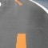
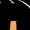
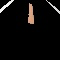
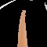
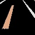
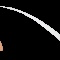
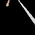
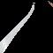
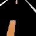

# 자율 주행 자동차

※ 이 프로젝트는 학교의 캡스톤 디자인 수업에서 ‘자율주행 자동차’라는 주제로 수행되었으며, 부품 선정, 설계, 구현 등 모든 과정은 학생 주도로 자율적으로 진행되었습니다.

<p> 
  <a href="README.md">日本語</a> 
  ·
  <a href="/README_ko.md">한국어</a> 
</p>

# 목차

[1. 프로젝트 개요](#프로젝트-개요)

[2. 시연 영상](#-시연-영상)

[3. 주요 부품 및 기술 스택](#주요-부품-및-기술-스택)

[4. 데이터셋 구성](#데이터셋-구성)

# 프로젝트 개요

본 프로젝트는 카메라 입력을 기반으로 도로 상황을 인식하고, CNN 모델을 활용해 실시간으로 조향값과 속도를 예측하여 차량을 제어하는 경량 자율주행 시스템입니다.

저전력 임베디드 보드에서도 원활하게 실행될 수 있도록 경량화에 중점을 두었으며, 하드웨어 제어와 인공지능 추론이 통합된 구조로 설계되었습니다.

# 🎬 시연 영상

| 자율주행 및 시스템 화면 (Shorts)                                                                       | 전체 주행 영상 (타임랩스)                                                                     |
| ------------------------------------------------------------------------------------------------------ | --------------------------------------------------------------------------------------------- |
| [](https://youtube.com/shorts/T73CptfG0oE) | [](https://youtu.be/Ltm1orm_lTM) |

<br>

# 주요 부품 및 기술 스택

### 🔧 하드웨어

| 구성 요소                | 용도                                   |
| ------------------------ | -------------------------------------- |
| Jetson Nano (4GB)        | 카메라 입력 수집, 모델 추론, 차량 제어 |
| 서보 모터 (MG996R)       | 조향 제어 (좌/우 회전)                 |
| DC 기어드 모터           | 차량 추진                              |
| 모터 드라이버 (L298N)    | 모터 구동 제어                         |
| 카메라 (로지텍 C920 PRO) | 실시간 전방 도로 이미지 입력           |
| RC 섀시                  | 전체 부품을 탑재한 차량 플랫폼         |

---

### 💻 소프트웨어 / 라이브러리

| 항목        | 설명                           |
| ----------- | ------------------------------ |
| Python 3.6  | 전체 프로그램 구현 언어        |
| PyTorch 1.9 | CNN 모델 구성 및 학습/추론     |
| OpenCV 4.1  | 이미지 처리 및 시각화          |
| NumPy       | 데이터 전처리 및 CSV 라벨 처리 |

# 데이터셋 구성

본 프로젝트는 실내 트랙이라는 고정된 환경에서 수집된 데이터를 기반으로,  
경량화와 트랙의 주행 안정성 확보에 중점을 두고 학습을 진행하였습니다.

### 데이터 구조

- 총 이미지 수: 약 14,500장
- 입력 크기: 320×240 RGB
- 라벨 구성: 총 6가지 조합
  - 기본 속도: 좌회전 2단계, 직진, 우회전 2단계
  - 최고 속도: 직진 1개
- 저장 방식:
  - 폴더 이름이 각도와 속도의 라벨 역할을 하며, 그 안에 이미지가 저장됨

```bash
images/
    ├── angle_70/
    │   ├── 0001.jpg
    │   ├── 0002.jpg
    ├── angle_85/
    │   ├── 0001.jpg
    └── angle_100/
        ├── 0001.jpg
        ...
```

### 🧼 전처리

- ROI 추출: 320×240 → 320x160
- 이미지 리사이징: 320×160 → 60x60
- 트랙 선 추출: **흰색과 노란색**만 마스킹 처리하여 배경 제거
- 중복 프레임 및 비정상 값 제거

| 원본 이미지                                | ROI & 리사이징                                                         | 마스킹                                                                |
| ------------------------------------------ | ---------------------------------------------------------------------- | --------------------------------------------------------------------- |
|  | <div align="center"></div> | <div align="center"></div> |

### 🖼️ 조향 각도별 학습 이미지 샘플

아래는 각 조향 각도에 따라 전처리된 학습 이미지의 일부 예시입니다.

| 각도    | -30                                             | -15                                             | 0                                             | +15                                            | +30                                            | 0 (Fast)                                           |
| ------- | ----------------------------------------------- | ----------------------------------------------- | --------------------------------------------- | ---------------------------------------------- | ---------------------------------------------- | -------------------------------------------------- |
| 샘플 #1 |  |  |  |  |  |  |
| 샘플 #2 |  |  |  |  |  |  |
| 샘플 #3 |  |  |  |  |  |  |
